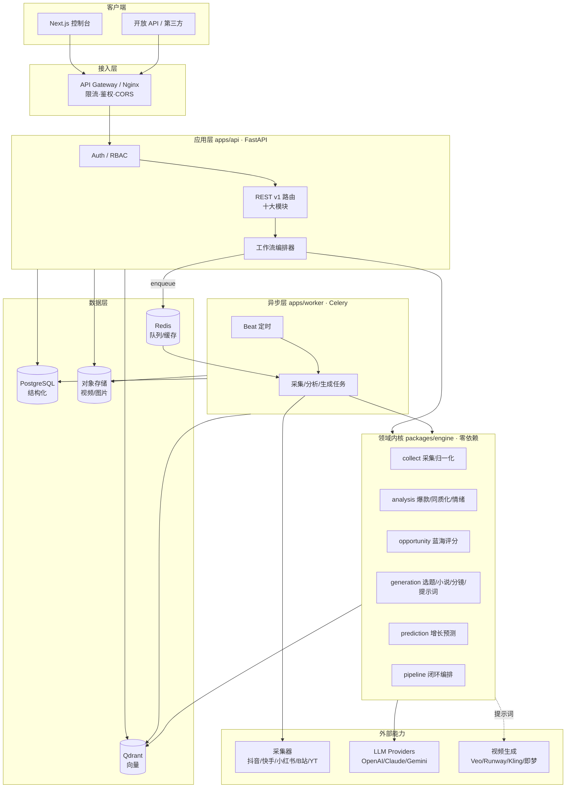
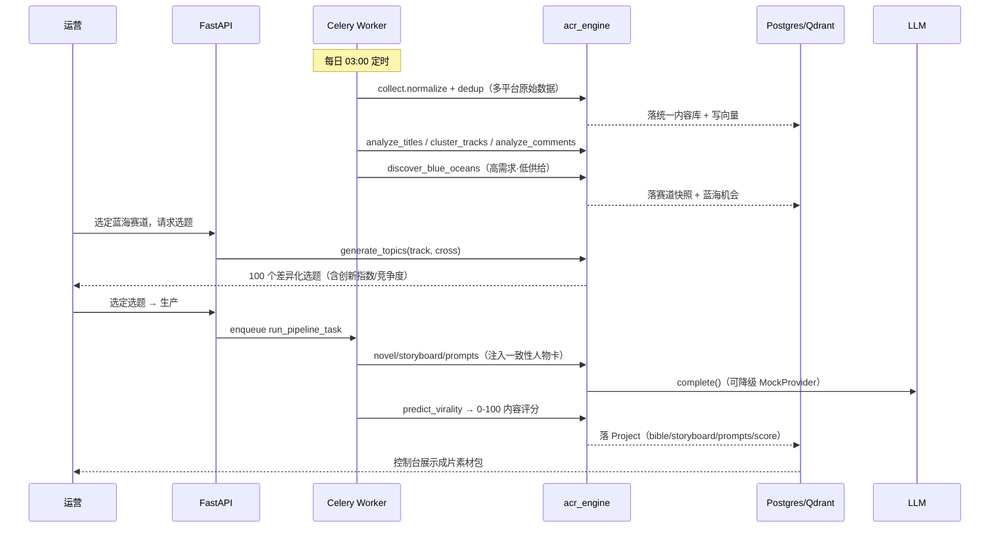
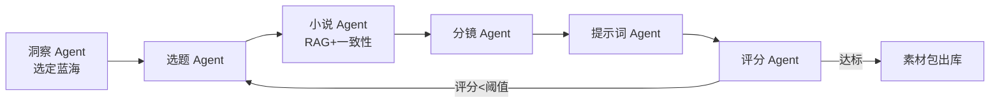
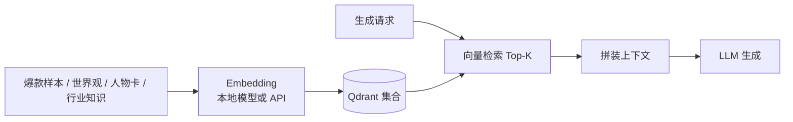

# 01 · 系统架构

## 1. 架构总览

采用**六边形架构（端口与适配器）+ 事件驱动**：算法内核 `acr_engine`
位于核心、零外部依赖；采集、存储、LLM、Web 都是可替换的适配器。

## 2. 数据流：从洞察到生产

## 3. 分层职责

| 层 | 目录 | 职责 | 依赖 |
|----|------|------|------|
| 领域内核 | `packages/engine` | 全部业务规则与算法 | **无三方依赖** |
| 应用层 | `apps/api` | HTTP、鉴权、编排、DTO 转换 | engine + FastAPI |
| 异步层 | `apps/worker` | 采集/分析/生成的长任务、定时 | engine + Celery |
| 表现层 | `apps/web` | 可视化、交互、报告下载 | API |
| 数据层 | PG/Qdrant/Redis/OBJ | 持久化、向量检索、队列、素材 | - |

**关键收益**：内核零依赖 ⇒ 同一份算法可在 FastAPI、Celery、Jupyter、
Serverless、CI 中无差别运行，并被 11 个单元测试覆盖。

## 4. 多 Agent 协同

工作流编排器把生产拆为可协同的 Agent，经黑板（Project.payload）共享上下文：

- **共享记忆**：RAG 知识库（Qdrant）保存世界观 Bible、人物卡、历史爆款样本。
- **反馈闭环**：评分 Agent 不达标时回退重选/重写，形成自优化循环。

## 5. RAG 知识库

集合划分：`hot_samples`（爆款语料）、`story_bible`（设定/人物，保证一致性）、
`domain_kb`（行业知识）。详见 02-数据库设计。

## 6. 非功能性

| 维度 | 方案 |
|------|------|
| 可观测 | 结构化日志 + OpenTelemetry trace + Prometheus 指标 |
| 弹性 | Worker 水平扩缩；任务幂等 + 重试 + 死信队列 |
| 安全 | JWT + RBAC + 行级多租户隔离 + 审计日志 |
| 成本 | LLM 多模型路由（按难度选模型）+ 结果缓存 + 批处理 |
| 合规 | 采集遵守平台条款/robots；数据脱敏；可溯源 |
