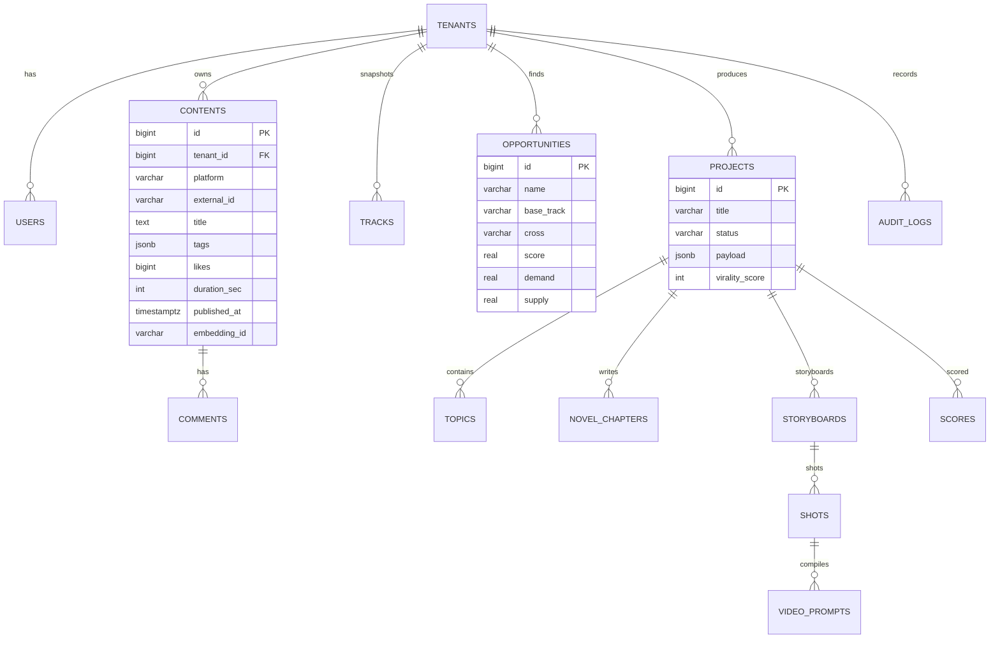

# 02 · 数据库设计

## 1. 存储选型

| 存储 | 用途 |
|------|------|
| PostgreSQL 16 | 结构化主数据（内容、赛道、机会、项目、用户、审计） |
| Qdrant | 内容/世界观/知识的向量检索（同质化聚类、RAG、查重） |
| Redis | Celery broker/backend、热点缓存、限流计数 |
| 对象存储(S3/OSS) | 生成的图片、视频、导出报告 |

多租户策略：**共享库 + `tenant_id` 行级隔离**（启用 Postgres RLS 策略），
大客户可升级为独立 Schema / 独立库。

## 2. ER 图



## 3. 核心表

> 可直接执行的 DDL 见 [`infra/postgres/init.sql`](../infra/postgres/init.sql)，
> ORM 定义见 [`apps/api/app/models/orm.py`](../apps/api/app/models/orm.py)。

### 3.1 contents（统一内容库 · 模块1）
关键约束：`UNIQUE(tenant_id, platform, external_id)` 实现跨平台去重；
`published_at` 降序索引支撑「近 7 天 vs 前 7 天」增长率计算；`embedding_id`
指向 Qdrant point。

### 3.2 tracks（赛道快照 · 模块3）
按 `snapshot_date` 存历史快照，支撑增长率趋势与红海地图时间轴。
字段：`share / growth_rate / competition_index / avg_engagement`。

### 3.3 opportunities（蓝海机会 · 模块5）
存 `score / demand / supply / growth`，`(tenant_id, score DESC)` 索引取 TopN。

### 3.4 projects（生产项目 · 模块6-10）
一个生产闭环的聚合根。`payload(jsonb)` 内嵌 `bible / storyboard / prompts`，
`virality_score` 冗余出列便于排序；重内容（章节正文）拆到 `novel_chapters`。

### 3.5 衍生表（生产产物）

| 表 | 说明 |
|----|------|
| `topics` | 选题（hook/conflict/audience/competition/novelty） |
| `novel_chapters` | 章节正文，`(project_id, idx)` 唯一，支持断点续写 |
| `storyboards` / `shots` | 分镜与镜头（景别/机位/对白/旁白/转场/时长） |
| `video_prompts` | `(shot_id, target_model)` 编译后的提示词 |
| `scores` | 历次增长预测结果（含 breakdown/suggestions） |

### 3.6 治理表
- `users`：`role ∈ {owner, admin, member, viewer}`（RBAC，详见 03/07）。
- `audit_logs`：`(tenant_id, created_at DESC)` 索引，记录 who/when/what。

## 4. Qdrant 向量集合

| 集合 | 向量来源 | 用途 |
|------|----------|------|
| `content_vectors` | 标题+文案 embedding | 同质化聚类、爆款查重、相似选题排重 |
| `story_bible` | 世界观/人物卡 embedding | 小说生成时检索，保证**人物一致性** |
| `domain_kb` | 行业知识/写作技法 | RAG 增强生成质量 |

Payload 示例（`content_vectors`）：
```json
{ "content_id": 1234, "tenant_id": 1, "platform": "douyin",
  "track": "退婚流", "engagement": 8200 }
```
检索：HNSW + cosine；按 `tenant_id` 过滤实现租户隔离。

## 5. 索引与性能

- 时序查询：`contents(published_at DESC)`、`audit_logs(created_at DESC)`。
- 排行榜：`opportunities(tenant_id, score DESC)`、`projects(tenant_id, virality_score DESC)`。
- 大表 `contents / comments` 按 `published_at` 月度分区（PG 原生分区）。
- 冷热分层：90 天前内容归档到对象存储 + 列存（如 ClickHouse）做 OLAP。

## 6. 迁移与一致性

- Alembic 管理 schema 演进（版本化、可回滚）。
- 写内容库与写向量库用**双写 + 异步对账任务**（worker）保证最终一致。
- 关键金额/配额操作走事务；生成任务幂等键 = `(project_id, step)`。
