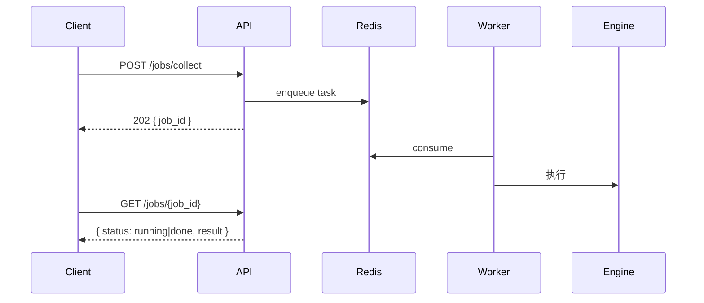

# 03 · API 设计

## 1. 约定

- 基础路径：`/api/v1`，JSON，UTF-8。
- 鉴权：`Authorization: Bearer <JWT>`；JWT 内含 `tenant_id / user_id / role`。
- 幂等：写操作支持 `Idempotency-Key` 头。
- 错误体：`{ "error": { "code": "string", "message": "string", "trace_id": "..." } }`。
- 分页：`?page=1&size=20`，响应含 `{ items, total, page, size }`。
- 限流：按租户套餐配额（见 07 企业方案），超限返回 `429`。

> 实现见 [`apps/api/app/api/v1/router.py`](../apps/api/app/api/v1/router.py)。
> 启动后 OpenAPI 文档自动生成于 `/docs`。

## 2. 端点总览（按十大模块）

| 方法 | 路径 | 模块 | 说明 |
|------|------|------|------|
| GET  | `/health` | - | 健康检查 |
| POST | `/collect/normalize` | 1 | 原始数据归一化+去重 |
| POST | `/hot/analyze` | 2 | 爆款规律报告 |
| POST | `/homogeneity/analyze` | 3 | 红海赛道地图 |
| POST | `/sentiment/analyze` | 4 | 用户需求雷达 |
| POST | `/opportunity/discover` | 5 | 蓝海机会(Opportunity Score) |
| POST | `/topics/generate` | 6 | 100 个差异化选题 |
| POST | `/novel/bible` | 7 | 世界观+大纲(人物一致) |
| POST | `/storyboard/generate` | 8+9 | 分镜 + 视频提示词 |
| POST | `/virality/predict` | 10 | 0-100 内容评分 |
| POST | `/pipeline/run` | 全部 | 一键闭环 |

异步与治理类（详见 07）：

| 方法 | 路径 | 说明 |
|------|------|------|
| POST | `/jobs/collect` | 触发异步全量采集，返回 `job_id` |
| GET  | `/jobs/{job_id}` | 查询任务状态/结果 |
| POST | `/auth/login` · `/auth/refresh` | 鉴权 |
| GET/POST | `/projects` · `/projects/{id}` | 生产项目管理 |
| GET  | `/audit-logs` | 审计查询（admin） |

## 3. 关键接口契约

### 3.1 `POST /opportunity/discover`（模块5）
请求：
```json
{
  "base_tracks": ["修仙", "都市"],
  "track_supply":  { "修仙": 0.8, "都市": 0.5 },
  "track_growth":  { "修仙": 0.2, "都市": 0.1 },
  "cross_dimensions": ["AI", "工业文明", "时间循环"],
  "top_k": 20
}
```
响应：
```json
{
  "count": 20,
  "blue_oceans": [
    { "name": "修仙 + 工业文明", "base_track": "修仙", "cross": "工业文明",
      "score": 61.2, "demand": 0.72, "supply": 0.28, "growth": 0.2,
      "rationale": "修仙 已有受众基础…× 工业文明 供给稀缺…高需求低供给。" }
  ]
}
```
> 评分公式 `100·demand·(1-supply)·growth_multiplier`，见
> [`opportunity/scoring.py`](../packages/engine/acr_engine/opportunity/scoring.py)。

### 3.2 `POST /topics/generate`（模块6）
请求：`{ "track": "修仙", "cross": "工业文明", "n": 100, "liked_tags": ["杀伐果断"] }`
响应：`{ "count": 100, "topics": [{ "title","hook","conflict","audience","competition","novelty" }] }`

### 3.3 `POST /storyboard/generate`（模块8+9）
请求：`{ "title": "...", "logline": "...", "beats": ["对峙","反转"], "target_models": ["veo","kling","jimeng"] }`
响应：
```json
{
  "storyboard": { "title": "...", "total_duration": 18.0,
    "shots": [{ "index":1,"shot_size":"特写","camera":"推","scene":"...","action":"...",
                "dialogue":"...","voiceover":"...","transition":"硬切","duration_sec":2.5 }] },
  "video_prompts": [{ "shot_index":1, "target":"veo", "prompt":"...", "negative_prompt":"..." }]
}
```

### 3.4 `POST /virality/predict`（模块10）
请求：
```json
{ "hook_strength":0.9, "title_len":17, "duration_sec":33, "opening_3s_hook":true,
  "novelty":0.8, "track_competition":20, "sentiment_fit":0.9, "post_hour":20 }
```
响应：
```json
{ "score": 86, "viral_probability": 0.78,
  "predicted_engagement_rate": 0.094, "predicted_completion_rate": 0.71,
  "breakdown": { "hook": 21.6, "opening": 16.0, ... },
  "suggestions": ["各项指标均在健康区间，可直接进入生产流水线。"] }
```

### 3.5 `POST /pipeline/run`（全自动闭环）
请求：
```json
{ "items": [ { "platform":"douyin", "raw": { "aweme_id":"x","desc":"开局无敌","digg_count":900,"duration":33,"create_time":1751000000 } } ],
  "comments": [ { "text":"节奏快 杀伐果断", "likes":50 } ],
  "n_topics": 100 }
```
响应：`hot_report / homogeneity / sentiment / blue_oceans / topics / chosen_topic / novel_bible / storyboard / video_prompts / virality` 一次性返回。

## 4. 异步任务模式

长耗时（全量采集、批量生成 1000 章）走异步：


## 5. 版本化与开放平台
- URL 版本（`/api/v1`）；破坏性变更升 `/v2`，旧版灰度下线。
- 对外开放 API 用 API Key + HMAC 签名 + 配额；提供 OpenAPI/SDK。
- Webhook：任务完成回调租户配置的 URL（带签名）。
