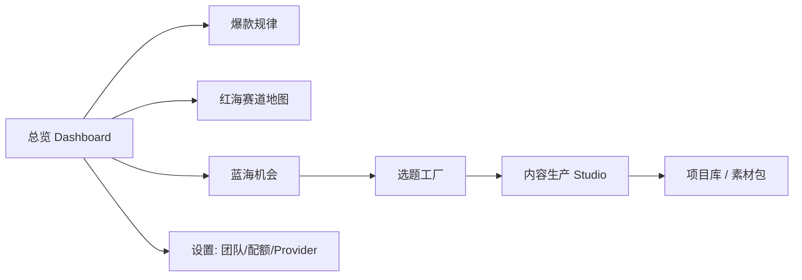

# 04 · 页面原型

## 0. 信息架构 / 导航



实现骨架见 [`apps/web/src/app/`](../apps/web/src/app/)（Next.js 14 App Router）。

## 1. 总览 Dashboard

```
┌────────────────────────────────────────────────────────────┐
│ 📡 Content Radar        [全网雷达 ▾]  [近7天 ▾]   👤 团队 ▾ │
├──────────┬──────────┬──────────┬──────────┬─────────────────┤
│ 蓝海TOP1 │ 选中选题 │ 内容评分 │ 在产项目 │  今日新增爆款    │
│ 修仙×AI  │  退婚…   │  86/100  │   12     │     324          │
│ 机会 61  │ 创新0.8  │ 爆款78%  │          │   ▲ 18%          │
├──────────┴──────────┴──────────┴──────────┴─────────────────┤
│  [折线] 赛道增长趋势            │  [雷达] 用户需求(喜欢/讨厌) │
├────────────────────────────────┼─────────────────────────────┤
│  [▶ 运行闭环]  最近一次：洞察→选题→分镜→评分 已完成           │
└────────────────────────────────────────────────────────────┘
```
交互见 [`page.tsx`](../apps/web/src/app/page.tsx)：一键触发 `/pipeline/run` 并展示卡片。

## 2. 爆款规律（模块2）

```
┌ 爆款规律报告 ───────────────────────────────────────────┐
│ 高溢价钩子词（lift 降序）                                 │
│  开局 ███████████ x3.1   重生 █████████ x2.6   退婚 …     │
│ 最佳时长：21-45s（平均互动最高）                          │
│ 标题甜区：12-22 字     [导出 PDF]                         │
└──────────────────────────────────────────────────────────┘
```

## 3. 红海赛道地图（模块3）

气泡图：X=内容占比，Y=增长率，气泡大小=样本量，颜色=竞争指数。
右上（高占比·高增长）= 拥挤红海；左上（低占比·高增长）= 潜力区。
```
增长率 ▲
       │      ○系统流
       │ ○重生流          ●退婚流(红)
       └───────────────────────▶ 内容占比
点击赛道 → 抽屉展开子流派拆解（废材/退婚/系统/重生/无敌流占比）
```

## 4. 蓝海机会（模块5）

```
┌ 蓝海机会报告  ────────────────────────────[筛选: 机会分>50]┐
│ # 组合            机会分  需求  供给  增速  动作            │
│ 1 修仙×工业文明    61.2   0.72  0.28  +20% [生成选题→]      │
│ 2 修仙×时间循环    58.7   0.70  0.27  +15% [生成选题→]      │
│ 3 修仙×AI          57.4   0.69  0.29  +20% [生成选题→]      │
│ 悬浮显示 rationale：为什么这是高需求低供给的空白            │
└──────────────────────────────────────────────────────────┘
```

## 5. 选题工厂（模块6）

```
┌ 选题工厂  目标赛道: 修仙×工业文明   [生成100个]  排序:创新↓ ┐
│ ☑ 标题                          创新   竞争  人群          │
│ ☐ 【修仙×工业文明】开局即巅峰…  0.86   18   下沉男频  [选用]│
│ ☐ 【修仙×工业文明】信息差打脸…  0.81   22   科幻迷    [选用]│
│ … 批量选用 → 进入生产                                       │
└──────────────────────────────────────────────────────────┘
```

## 6. 内容生产 Studio（模块7/8/9/10）

四联工作台（Tab 切换，同一 Project 黑板共享）：

```
┌ Studio · 《修仙工业纪元》 ──────────────── 评分 86/100 [发布]┐
│ [世界观/大纲] [章节正文] [分镜] [视频提示词] [增长预测]      │
├──────────────────────────────────────────────────────────┤
│ 世界观: …   成长体系: …   人物卡(锁定一致性): 主角/宿敌/导师 │
│ 大纲: 第1章[起]… 第2章[承]…  (100章, 可展开1000章框架)       │
│ ───────────分镜───────────  ───────────提示词───────────    │
│ #1 特写/推 主角低头隐忍      Veo: close-up, slow push-in…   │
│ #2 中景/跟 反派挑衅          Kling(中文): 中景,跟镜头,国风… │
│ 评分面板: 钩子21.6 开场16 创新… [建议: 前3秒加强钩子]       │
└──────────────────────────────────────────────────────────┘
```

## 7. 设置 / 团队

- 成员与角色（owner/admin/member/viewer，对应 RBAC）。
- LLM Provider 与 Key 配置、默认模型路由策略。
- 配额与用量、计费、Webhook、审计日志查询。

## 8. 设计规范
- 暗色侧栏 + 浅色工作区；主色 `#2563eb`，红海告警 `#ef4444`，蓝海 `#06b6d4`。
- 图表库 Recharts；大数据表虚拟滚动；所有报告支持 PDF/Excel 导出。
- 响应式：≥1280 三栏，平板两栏，移动端单栏 + 底部 Tab。
