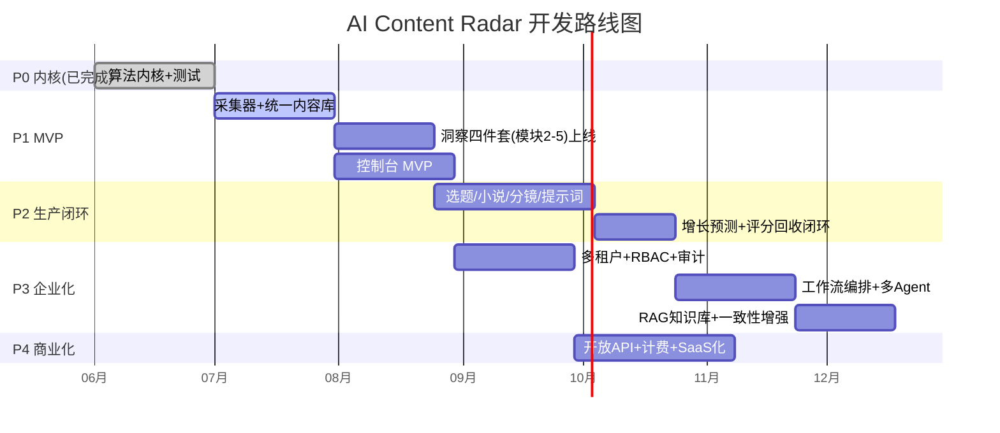

# 05 · 开发路线图

## 里程碑总览

## 阶段拆解

### P0 · 算法内核（✅ 本仓库已交付）
- `packages/engine` 十大模块算法 + 端到端 `pipeline` + 11 个单测全绿。
- 价值：业务规则先验证、可独立演进，后续各层只做接入。

### P1 · MVP（4-6 周）
**目标**：单租户跑通「采集 → 洞察 → 蓝海机会」。
- 接入至少 1 个平台采集器（建议先抖音/B站），落统一内容库。
- 模块2-5 上线，控制台展示爆款规律 / 红海地图 / 蓝海机会 / 需求雷达。
- 出口：运营能用真实数据得到《蓝海机会报告》。详见 06-MVP。

### P2 · 生产闭环（6-8 周）
- 选题工厂 + 小说 Bible/大纲/章节（人物一致性）。
- 分镜 + 多模型视频提示词；增长预测评分并回流形成自优化。
- 出口：从一个蓝海机会一键产出「选题→分镜→提示词→评分」素材包。

### P3 · 企业化（8-10 周）
- 多租户 + RBAC + 审计日志 + 配额。
- 工作流编排器 + 多 Agent 协同（评分不达标自动回退重写）。
- RAG 知识库（Qdrant）增强生成质量与一致性。

### P4 · 商业化（8-10 周）
- 开放 API + API Key/签名/配额；计费与套餐；Webhook。
- 插件市场（采集器、生成器、评分模型可第三方扩展）。
- 多区域部署、SLA、可观测性体系完善。

## 团队与节奏（建议）
| 角色 | 人数 | 主要阶段 |
|------|------|----------|
| 全栈/后端 | 2-3 | 全程 |
| 前端 | 1-2 | P1+ |
| 数据/算法 | 1-2 | P0/P2/P3（评分模型、聚类、RAG） |
| 数据采集工程 | 1 | P1（合规采集器） |
| 产品/运营 | 1 | 全程（词库、评测、标注） |

双周迭代；每阶段以「可演示出口」为验收。

## 风险与对策
| 风险 | 对策 |
|------|------|
| 平台采集合规/反爬 | 优先官方开放 API；限速、缓存；可插拔采集器隔离风险 |
| LLM 成本/波动 | 多模型路由 + 缓存 + 批处理；MockProvider 兜底降级 |
| 生成质量/一致性 | RAG + 人物卡锁定 + 评分回退闭环 + 人审环节 |
| 评分模型冷启动 | 先用可解释启发式基线，积累数据后切 ML（接口已对齐） |
