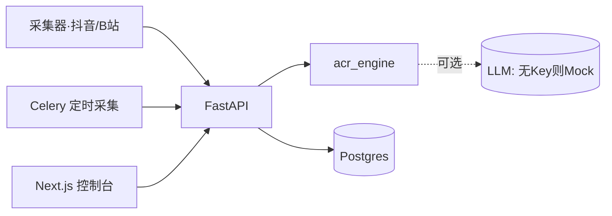

# 06 · MVP 方案

## 1. MVP 目标

用**最小可用闭环**验证核心假设：

> 「我们能用数据帮创作者找到值得做的蓝海选题，并一键产出可制作的素材包。」

MVP 聚焦验证两件事：
1. **洞察可信**：蓝海机会报告对运营有决策价值；
2. **生产可用**：从一个机会能产出可直接拍摄/生成的素材包。

## 2. MVP 范围（In / Out）

| 模块 | MVP 内 | 说明 |
|------|:------:|------|
| 1 采集 | ✅(1-2 平台) | 先抖音 + B站，官方/合规接口，单租户 |
| 2 爆款规律 | ✅ | 钩子词/时长/标题甜区 |
| 3 同质化 | ✅ | 词典聚类版红海地图（聚类升级留后） |
| 4 评论情绪 | ✅ | 词典版需求雷达 |
| 5 蓝海机会 | ✅ | Opportunity Score + 报告 |
| 6 选题 | ✅ | 100 选题（模板+可选 LLM 润色） |
| 7 小说 | ◑ | Bible+大纲+单章试写（不做 1000 章批量） |
| 8 分镜 | ✅ | 标准节奏模板分镜 |
| 9 视频提示词 | ✅ | Veo/Kling/即梦三家 |
| 10 增长预测 | ✅ | 启发式 0-100 评分 |
| 多租户/RBAC | ❌ | P3 |
| 工作流编排/多Agent | ❌(用 pipeline 串) | P3 |
| 开放API/计费 | ❌ | P4 |

> 关键：算法十大模块在 `packages/engine` **已全部可运行**，MVP 主要工作量在
> **采集器 + 落库 + 前端可视化 + LLM 接入**，而非算法本身。

## 3. MVP 架构（精简）


- 去掉 Qdrant（同质化先用词典版），降低部署复杂度；P3 再引入向量库。
- 单租户、单实例 docker-compose 即可上线试用。

## 4. MVP 用户旅程

```
运营登录 → 看 Dashboard(今日爆款/赛道趋势)
      → 打开「蓝海机会」→ 选「修仙×工业文明」
      → 点「生成100选题」→ 选 1 个
      → Studio 一键生成: 世界观+大纲+分镜+提示词+评分
      → 导出素材包(PDF/JSON) → 交付制作
```

## 5. 验收标准（DoD）
- [ ] 采集 ≥ 2 平台、≥ 1 万条内容入统一库，去重正确。
- [ ] 《蓝海机会报告》TopN 可解释（含 rationale），运营盲测认可率 ≥ 60%。
- [ ] 任一机会能在 < 60s 产出完整素材包（含评分与改进建议）。
- [ ] 引擎单测全绿（已具备），关键 API 有集成测试。
- [ ] docker-compose 一键启动，README 跑通。

## 6. MVP 工期与里程碑
| 周 | 交付 |
|----|------|
| W1-2 | 采集器 + 统一内容库 + 去重；引擎接入 API |
| W3 | 模块2-5 洞察接口 + 控制台洞察页 |
| W4 | 选题/分镜/提示词/评分接口 + Studio 页 |
| W5 | 小说 Bible/大纲/单章 + 导出 + LLM 接入 |
| W6 | 联调、集成测试、试用上线、收集反馈 |

## 7. MVP 后的关键指标（北极星）
- **决策采纳率**：运营采用系统推荐选题的比例。
- **素材包→成片转化率**：素材包真正被制作成片的比例。
- **命中率**：系统高分内容的实际爆款率 vs 基线。
