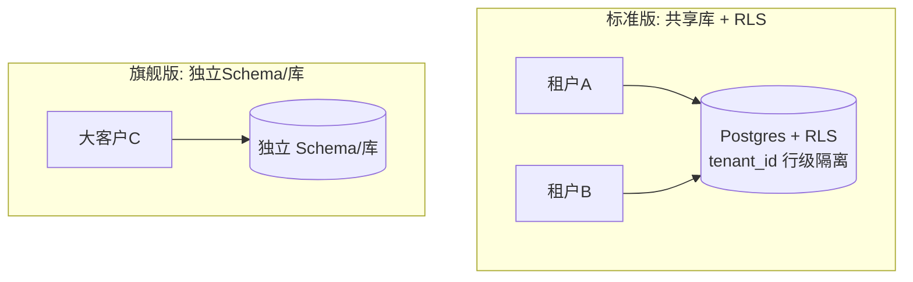
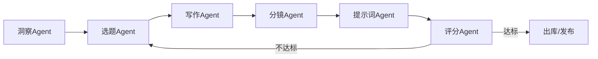
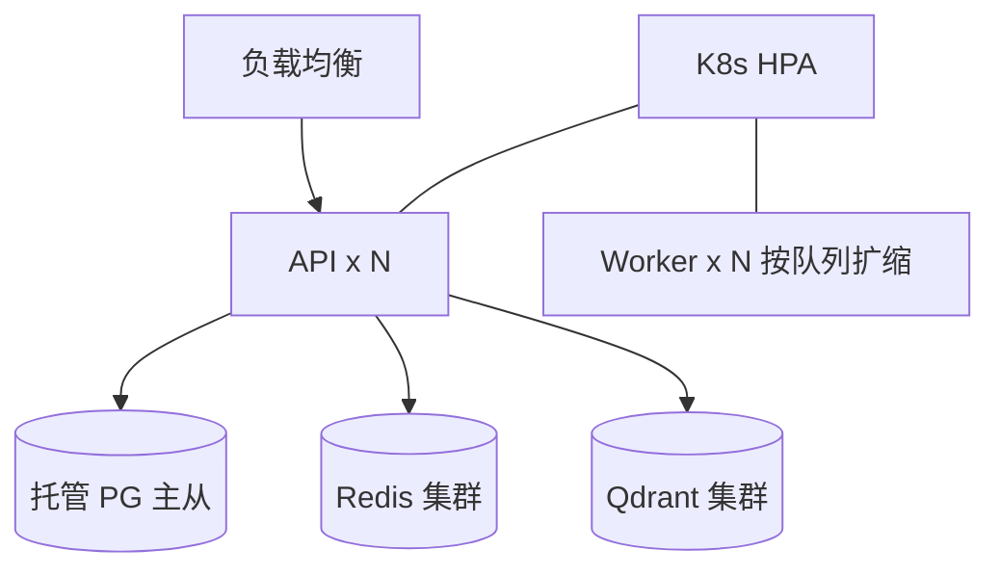

# 07 · 企业级升级方案

从 MVP 到企业级 SaaS 的能力补齐。所有方向均已在内核/架构中预留扩展点。

## 1. 多租户与隔离

- 全表带 `tenant_id`，启用 Postgres RLS 策略，应用层 JWT 注入租户上下文。
- Qdrant 按 `tenant_id` payload 过滤；大客户可独立 collection。
- 分层：Free（共享）→ Pro（共享+高配额）→ Enterprise（独享/私有化）。

## 2. 权限管理（RBAC）

| 角色 | 权限 |
|------|------|
| owner | 全部 + 计费 + 成员管理 |
| admin | 数据/项目/配置管理、审计查看 |
| member | 洞察、生产、导出 |
| viewer | 只读报告 |

- 资源级 + 操作级权限（如 `project:create`、`audit:read`）。
- 可选 ABAC（按赛道/项目标签授权）；SSO（OIDC/SAML）、SCIM 用户同步。

## 3. 工作流编排 + 多 Agent

把 `pipeline.py` 升级为可配置 DAG 编排器（Celery Canvas / Temporal）：

- 节点可重试/补偿/人审插入（human-in-the-loop）。
- 编排定义存库，运营可在 UI 拖拽自定义流程（低代码）。
- Agent 间经黑板（Project.payload + RAG 记忆）共享上下文。

## 4. RAG 知识库

- 集合：`hot_samples`（爆款语料）/`story_bible`（设定·人物，保一致）/`domain_kb`（行业知识）。
- 生成前检索 Top-K 注入 prompt；写作 Agent 强制读取人物卡，杜绝人设漂移。
- 知识治理：版本化、引用溯源、过期淘汰、质量评分回流。

## 5. 插件化扩展

| 扩展点 | 端口 | 第三方可插 |
|--------|------|-----------|
| 采集器 | `Collector` | 新平台 |
| LLM | `LLMProvider`（已实现） | 任意模型/路由策略 |
| 聚类 | `cluster_tracks` 可替换为 Embedding+HDBSCAN | 更强同质化分析 |
| 评分 | `ViralityInput` 契约 | ML/GBDT 模型热插拔 |
| 视频后端 | 提示词目标模型表 | 新视频模型 |

插件经清单(manifest)注册、沙箱执行、权限/配额受控 → **插件市场**。

## 6. LLM 成本与质量治理
- **多模型路由**：按任务难度/SLA 选模型（简单分类用小模型，长文用强模型）。
- **缓存**：相同 prompt/检索结果缓存；批量生成合并请求。
- **降级**：Provider 故障自动回退（含 MockProvider 兜底，保证流水线不中断）。
- **评测**：离线评测集 + 在线 A/B + 人审打分，闭环优化提示词与路由。

## 7. 可观测性与运维
- 日志：结构化 JSON + 集中检索（ELK/Loki）。
- 链路：OpenTelemetry trace（API→Worker→Engine→LLM）。
- 指标：Prometheus + Grafana（任务时延、LLM 花费、爆款命中率）。
- 告警：SLO/错误预算；任务死信队列 + 重放。

## 8. 安全与合规
- 传输 TLS、静态加密；密钥经 KMS/Secrets Manager。
- 审计日志不可篡改（追加写 + 周期归档）。
- 采集合规：尊重平台条款/robots、限速、数据脱敏、可删除（GDPR/个保法）。
- 内容安全：生成内容过合规审核（敏感词/价值观），人审兜底。

## 9. 部署与弹性

- 容器化 → K8s；API/Worker 无状态水平扩缩。
- PG 主从 + 读写分离 + 分区/归档；Redis/Qdrant 集群化。
- 蓝绿/金丝雀发布；IaC（Terraform）+ GitOps（ArgoCD）。

## 10. 商业化
- 计费：按席位 + 用量（采集量/生成 token/评分次数），配额与超额。
- 套餐：Free / Pro / Team / Enterprise（私有化部署）。
- 开放平台：API Key + 签名 + Webhook + SDK；合作伙伴分成。
